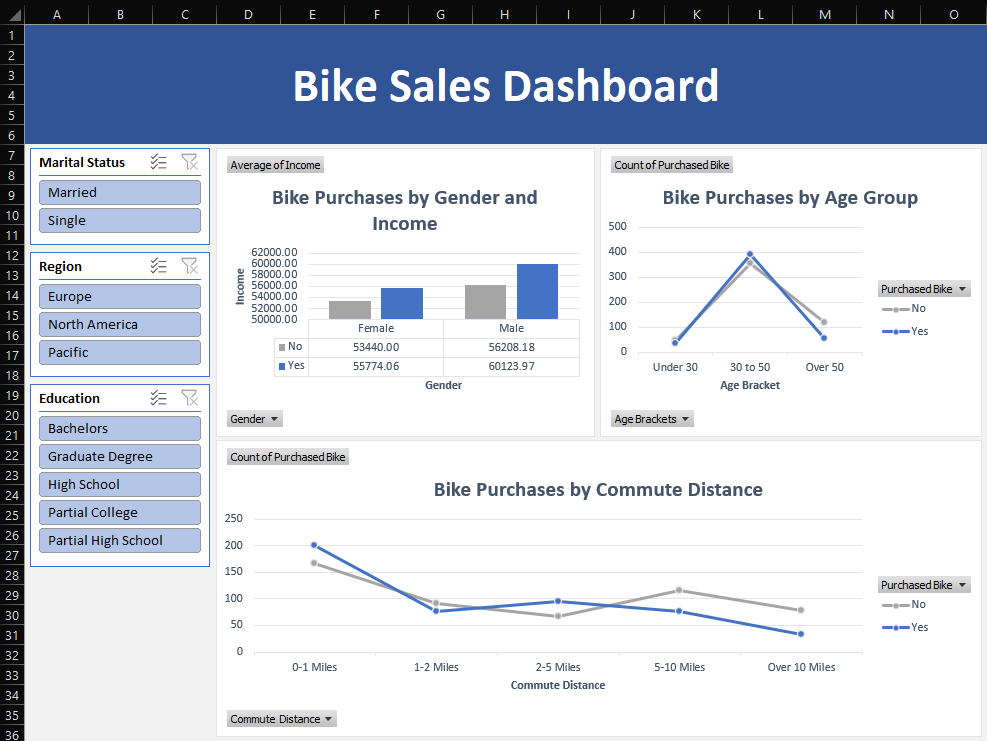

# Bike Sales Analysis and Visualization

This repository contains an excel project that analyzes and visualizes bike sales data using Excel. The analysis includes trends and patterns in the data, as well as the creation of interactive charts and graphs to help understand and communicate the insights derived from the data all presented in a dashboard.

## Contents

The repository includes the following files:

- `sales.xlsx`: Excel workbook with the dashboard, data, and pivot tables
- `raw-sales-data.csv`: CSV dataset used in this project

## Additional Resources

- [Excel documentation](https://support.office.com/en-us/excel)
